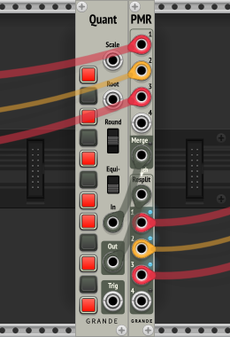
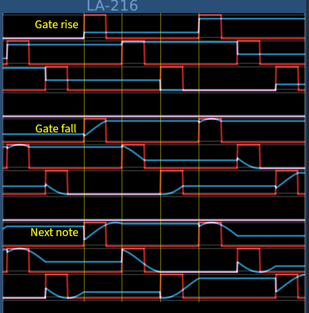
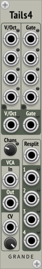
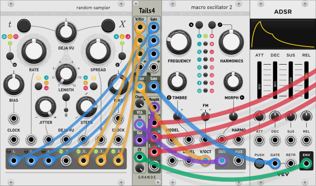

Grande Modules for VCV Rack 2
=============================

By David Grande

***

**New for v2.8.0:** Dark panels for all my modules are now supported using Rack 2.4's "Use dark panels if available" View option. See example image for **Clip** below, the others are similar.

***

Clip
----

**Polyphonic hard clipper and visual clip monitor.**

Provides two separate polyphonic clippers with displays, which clip to ±5V by default. The clipping voltage is adjustable by knob (up to ±10V), or polyphonic input voltages (up to ±20V). Can also be used to monitor polyphonic logic signals.

The display shows active (low) channels in blue, while any currently clipping (high) channels are shown in red. To use this just as a clip/logic monitor, just attach the inputs and don’t pass through this module.

- **A In and Out:** First signal to be clipped/monitored (polyphonic).

- **B In and Out:** Second signal to be clipped/monitored (polyphonic).

- **Vclip knob:** Allows adjusting the clipping voltage from 0 to ±10V (default ±5V). Applies to both A and B inputs, and all channels. Note that this is only enabled if the Vclip input port is unconnected.

- **Vclip input:** Alternative for setting clipping voltages. Input voltages (polyphonic) directly define clipping voltage to use for A and B, which are clipped to ±Vclip (per channel). In this case input values can range from 0V to 20V, and negative input values are converted to positive values.

- **Logic Monitoring (New for v2.6.2):** Right-click context menu option. By default the display is optimized to display clipping, which filters out most high-to-low transitions to reduce flashing lights. With **Logic Monitoring** enabled, low-to-high and high-to-low transitions are treated equally, which can work better for monitoring certain logic signals. Set threshold to 5V for 0-10V logic. (**Note:** this doesn't work with bipolar signals.)

***

Compare3
--------

**Three windowed comparators with common input.**

Provides three polyphonic windowed comparators connected to a common input, which will output separate gate signals when the input voltage falls within each comparator's Lower and Upper thresholds (B-Out in picture above).

The Lower threshold (displayed as red) recognizes higher voltages and uses a 'Vin ≥ Vlo' comparison by default. The Upper threshold (displayed as blue) recognizes lower voltages and uses a 'Vin < Vup' comparison by default.

It's also possible to disable **Windowing,** and just do Upper or Lower comparisons. The mode button turns red for **Lower threshold up** (A-Out above), and turns blue for **Upper threshold down** (C-Out above).

When the Upper threshold (blue) is set below the Lower threshold (red), this enables **Split mode,** with the Lower range (red) on top extending up towards +∞, while the Upper range (blue) is on the bottom extending down towards –∞.

- **Input:** Common input for all comparators (defines number of polyphonic channels).

- **Upper:** Separate upper threshold down knobs for each comparator (-10V to +10V).

- **Lower:** Separate lower threshold up knobs for each comparator (-10V to +10V).

- **A,B,C Out:** Gate outputs for each comparator (0V to +10V).

- **Window mode:** Separate small buttons that cycle through three modes: **Windowing** (no light), **Lower threshold up** (red light), and **Upper threshold down** (blue light).

- **Close interval toward zero:** Right-click context menu option. Changes comparison tests for negative thresholds. If set, negative Lower thresholds are tested with 'Vin > Vlo' *(removed '='),* while negative Upper thresholds are tested with 'Vin ≤ Vup' *(now includes '=').* Positive thresholds stay the same, so this makes the equality check (closed interval) always on the side closer to zero.

***

LFO3
----

**Three individual bipolar sine LFOs with separate frequency inputs.**

Provides three independent low-frequency bipolar sine oscillators in a compact package. Useful for creating multiple unrelated modulation sources.

- **Frequency knob:** Adjusts oscillator frequency from 0.0039 Hz (1/256 Hz) to 1024 Hz, with a default of 2 Hz.

- **Output:** Output is a bipolar sine wave (±5V).

- **FM input:** With a DC signal, this provides a V/Oct offset from the **Frequency knob** setting. With an AC signal, this frequency modulates the LFO output. In addition, it defines the number of polyphonic output channels.

- **FM knob:** Attenuverter for **FM input** (range ±100% with a default of 0%).

For modulating signals without built-in attenuators, or to also add an envelope to a modulation signal, consider using my companion **VCA3** module—a triple VCA (see below).

*Based on GPL3+ code from the VCV Fundamental LFO.*

***

LFO4
----

**Four ratioed bipolar sine LFOs with common primary frequency input.**

Provides four low-frequency bipolar sine oscillators in a compact package. Useful for creating multiple partially related modulation sources.

- **Frequency knob:** Primary frequency control. Adjusts oscillator frequency from 0.015625 Hz (1/64 Hz) to 256 Hz, with a default of 2 Hz.

- **Frequency CV input:** With a DC signal, this provides a V/Oct offset from the **Frequency knob** setting. With an AC signal, this frequency modulates all the LFO outputs. In addition, it defines the number of polyphonic output channels.

- **Negative CV mode button:** Since there wasn't room for an attenuverter, I've included a small button next to the Frequency CV input to provide the -verter functionality (internally multiplies the CV input by –1). Combined with my **VCA3** or **VCA4** modules, this provides full attenuverter control.

- **Ratio knobs:** Adjusts each separate LFO from 0.0039× (1/256×) to 256×, with a default of 1×. *(Note that too extreme combinations of primary frequency and ratio settings can cause the LFOs to exceed their frequency range.)*

- **Warning lights:** Red warning lights will turn on when the combination of Frequency and Ratio knobs are getting close to each LFO’s frequency limits—approximately 1/1024 Hz to 1024 Hz. *(**Note:** Warning lights disabled when Frequency CV input connected.)*

- **Outputs:** Output is a bipolar sine wave (±5V).

- **Presets:** Several irrational ratios are defined as presets. The A-output is set to 1×, and each subsequent output is further divided by the defined ratio: Golden = 1.618, Silver = 2.414, Bronze = 3.303, Copper = 4.236, Nickel = 5.193.

- Also supports **Track and Hold** functionality, where 0V on the Frequency CV input gives normal operation, while 10V freezes the output voltages. The **Negative CV mode** button must be enabled to give –10V internally. However, with the wide frequency range of these LFOs, it's possible that this won't be enough to fully stop the oscillations. In that case, I have included a right-click context menu for an **Extended Hold Range** mode, which additionally multiplies the CV input by 5×.

*Based on GPL3+ code from the VCV Fundamental LFO.*

***

Logic
-----

**Polyphonic logic gates.**

**New for v2.7.1:** The NOT gate now outputs a logic High (10V) when its input is unconnected. All the 2-input gates still output 0V when both their inputs are unconnected.

Provides a two-input **AND**, **OR**, and **XOR** gate, along with a **NOT** gate in a compact package. Voltage range is 0V to 10V, but any input voltage greater than 1V is recognized as a High. Additional modes are enabled when the 2-input gates only have one input connected.

**For each two-input gate the following modes apply:**

- **Two mono inputs:** simple logic gate with mono output.

- **One poly and one mono input (either order):** the single mono signal is combined with each channel of the poly signal. The number of output channels is defined by the polyphonic input.

- **Two poly inputs:** the corresponding channels of both inputs are combined. However, any unmatched channels are dropped. The number of output channels is defined by the input with the minimum number of channels.

- **Only A-input connected *(Across all channels mode)*:** The function is applied across all the channels of the A input, reducing the output to a mono result. *(See note below for more info on **XOR.**)*

- **Only B-input connected *(Not gate mode)*:** the B input channels are inverted and sent to the output. The number of output channels is defined by the B input.

- **No inputs connected:** If an output is connected with no inputs connected, a logic Low (0V) will be output.

**XOR mode button:** Defines algorithm for XOR when using Across all channels mode. Off = odd-parity mode. On = one-hot mode.

**For the NOT gate:**

- **Mono or poly input:** The NOT gate is a standard polyphonic gate, with each input channel logically inverted and sent to the output.

- **Input not connected:** If the output is connected with the input unconnected, a logic High (10V) will be output. **(New for v2.7.1)**

***

Merge8
------

**8-channel polyphonic merge.**

Provides an 8-channel mono-to-poly merger in a compact package.

*Based on my MergeSplit4 module, which was based on GPL3 code from 23Volts.*

***

MergeSplit4 (MS4)
-----------------

**4-channel polyphonic merge and split.**

Provides a 4-channel mono-to-poly merger and a 4-channel poly-to-mono splitter in a compact package.

Useful for feeding multiple monophonic signals into my polyphonic quantizers. Run Merge out to Quantizer In, and Quantizer Out back to Split In.

Note however that this combination, with a quantizer and **MergeSplit4,** adds three sample delays to the V/Oct path. My sampledelay modules can be used to match delays on the gate/trigger path (see below).

*Based on GPL3 code from 23Volts Merge4 and Split4, by Rémi Collins, at <https://github.com/23volts/23volts-vcv>. However, I didn’t use any of his artwork.*

***

Peak
----

**Captures polyphonic min/max peaks.**

Allows capturing the min and max voltage peaks from two different signals. Useful for debugging the source of troublesome pops and clicks.

Red warning lights turn on if any channel has a peak voltage that exceeds the **Threshold knob.** Greater than threshold for max (default +12V) and less than negative threshold for min (default –12V).

Min and Max outputs can be connected to mono/poly voltmeters for display, but this module fully takes advantage of Rack 2’s ability to display voltages in the port tooltips—and it does this without needing output wires connected.

- **A and B In:** Signals to be captured (polyphonic).

- **Max A and B Out:** Maximum voltage seen since last reset (polyphonic).

- **Min A and B Out:** Minimum voltage seen since last reset (polyphonic).

- **Reset A and B:** Separate reset buttons for each.

- **Threshold knob:** Adjusts the voltage to turn on the red warning lights when any polyphonic channel exceed this value (default 12V).

***

PolyMergeResplit (PMR)
----------------------

**Poly-to-poly Merge and Resplit back to the same channel widths.**

Provides a 4-to-1 poly-to-poly merger and a 1-to-4 poly-to-poly resplitter in a compact package.

Useful for combining multiple polyphonic signals, processing them with a single polyphonic module (such as a quantizer or VCO), and then resplitting the output signals back to their original number and channel widths.

**Merge:** Four polyphonic inputs to one polyphonic output.

- Channels are added to the output from the top input down.

- If the total number of input channels exceeds 16, the output is clamped to 16 channels, and a red warning light turns on.

- Note that unlike my **MergeSplit4,** skipped Merge inputs don’t add any channels to the output, but the corresponding Resplit outputs will also need to be skipped.

**Resplit:** One polyphonic input to four polyphonic outputs.

- The output channels mirror the Merge input channels, including gaps.

- A blue light next to each output indicates that this output has the same number of channels as the corresponding Merge input.

- A red light means that the channel count doesn’t match. Up means the output has too many channels, and down means too few channels.

**How to use PolyMergeResplit**

To route multiple polyphonic signals through one polyphonic quantizer:

- Connect any combination of poly and mono signals to the **PolyMergeResplit** Merge inputs. (If the total number of channels exceeds 16, a red warning light will come on.)

- Connect the **PMR** Merge output to the quantizer input.

- Connect the quantizer output back to the **PMR** Resplit input.

- Connect the corresponding quantized **PMR** Resplit outputs to wherever they need to go. They will automatically get set to the same channel widths as their inputs. (Blue lights indicate the channel counts match.)

***

PolySplit
---------

**Poly-to-poly splitter with visual selection of channel split points.**

Provides a 1-to-4 poly-to-poly splitter in a compact package.

The channels of the polyphonic input can be routed to up to four polyphonic outputs, with the split points defined by the triangular **split-point buttons** (bright red when selected).

- With no split points selected, all the input channels go to the first output.

- With one split point selected, the lower channels go to the first output and the upper channels go to the second output—if there are enough channels. (The blue **channel lights** on the right indicate the number of input channels.)

- This continues for the second and third split points, with higher channels going to the third and fourth outputs.

- If a fourth split point is selected, since there isn't a fifth output, this serves to truncate the number of channels in the fourth output. (The corresponding **channel lights** are dimmed to indicate when this happens.)

- If additional **split-point buttons** are selected, they are also dimmed to show that they are being ignored.

***

Push
----

**Polyphonic push-button switches.**

Provides 16 polyphonic channel buttons (0V/10V) in a compact package.

- Triangular select buttons on side set how many channel buttons to enable. Only one can be selected at a time. Channel buttons beyond this point are dimmed and won't be output.

- **New for v2.8.0:** Triangular buttons require a 1-sec long press to toggle.

- Channel buttons have two modes: normal mode (toggle, default) and radio mode (one-hot). Select between them by using the right-click context menu.

***

Quant
-----

**Normal 12-TET Quantizer with Equi-likely mode.**

- Combine with **MergeSplit4** or **PolyMergeResplit** to easily quantize multiple mono or poly signals respectively.

- **Scale:** Use **Scale** modules (see below) and a polyphonic switch to allow selecting different scales.

- **Root:** Defines root note of scale (1V/Oct, polyphonic), quantized.

- **Rounding mode:** Down = round down, center = round nearest, up = round up.

- **Equi-likely mode:** Down = off, up = on.

- **In:** Pitch input (1V/Oct, polyphonic).

- **Out:** Quantized pitch output (1V/Oct, polyphonic).

- **Trigger:** Outputs trigger whenever note changes (polyphonic).

- **Note buttons:** Set current scale, or display externally defined scale. Root on bottom. Defaults to major scale. If no notes are selected, defaults to just the root note.

**Factory Preset Scales *(new for version 2)***

Now easily set one of fourteen different common scales.

- Chromatic
- Major, Dorian, Phrygian, Lydian, Mixolydian, Aeolian *(Natural Minor)*, Locrian
- Harmonic Minor, Melodic Minor\*
- Major Pentatonic, Minor Pentatonic
- Blues, Whole Tone

\* *Just the modern ascending-only form of the Melodic Minor scale.*

**Explanation of Equi-likely mode**

Equi-likely mode changes the evenness of notes across the scale. The following images show the differences between normal mode and equi-likely mode using the Blues Scale, which is particularly obvious with its note intervals of 321132.

**Normal quantization** (and rounding down)

The probability of randomly getting each note (x-axis) depends on the interval between notes. Closely spaced notes are much less likely than farther spaced notes. With a random input, the probability of picking individual notes varies from 8% to 25%.

**Equi-likely quantization** (and rounding down)

In this case, every note is equally likely, with the probability of picking each note the same at 16.7.%

However, equi-likely mode is best for random input voltages. It can cause unexpected note shifting for inputs that are already more-or-less quantized.

***

SampleDelays (SD)
-----------------

**3 sample delay buffer chains.**

Provides three independent sample-delay buffer chains giving one or two sample delays each (polyphonic).

- Internally chained together to give up to six sample delays.

***

Scale
-----

**Extra scales for the Quant quantizer.**

- Sends 12 control signals using a polyphonic cable (0V or 10V).

- Route multiple **Scale** modules through a polyphonic switch, and into the Scale input of **Quant.**

- Provides the same fourteen factory preset scales as **Quant.**

***

Split8
------

**8-channel polyphonic split.**

Provides an 8-channel poly-to-mono splitter in a compact package.

*Based on my MergeSplit4 module, which was based on GPL3 code from 23Volts.*

***

Tails
-----

**Mono-to-poly sequential note splitter—helps preserve envelope tails.**

**New for v2.7.1:** Context modes have been changed. There is now a new Latch mode with three options to replace the old setup, and delays are now fixed per mode. (See below for details.)

***—For dealing with polyphonic signals, see my Tails4 module below.***

**Tails** takes a monophonic sequence of notes, as defined by a gate pulse and a V/Oct pitch value, and splits them into multiple polyphonic channels. Gate pulse lengths are not changed, so there can still only be one active note playing at a time. However, by giving each note a separate channel, this allows for each note’s release envelope to continue playing in parallel, giving a much fuller sound.

This is particularly useful for irregular tempos, where widely spaced notes have time to play their tails, but closely spaced notes get cut off abruptly. Note however, that since there’s only one pitch value per note, chords are not directly supported.

**Without Tails:** Notes and their envelopes get cut off abruptly when a new note appears.

**With Tails:** Even with just two channels, notes and their envelopes now have significant overlap with the following note. Up to five channels are available for extreme cases.

**Warning:** Requires use of a polyphonic oscillator (fairly common), and a polyphonic envelope generator (not so common).

**Notes Section:**

- **Mono pitch input:** Feed in a monophonic sequence of V/Oct note pitches. Each value is latched on the rising edge of its corresponding gate pulse (unless **Don't latch current note** context option is enabled).

- **Poly pitch output:** Connect to the V/Oct input of a polyphonic oscillator.

- **Mono gate/trigger input:** Feed in a monophonic sequence of gate/trigger pulses, the more irregular the better.

- **Poly gate/trigger output:** Connect to the Gate or Trigger input of a polyphonic oscillator or envelope generator.

- **Chans knob:** Defines how many polyphonic channels to output, from 1 to 5.

- **Latch mode (v2.7.1 update):** Context menu option to select when the current note's V/Oct input will be latched.

	- **Gate rise:** The V/Oct input is latched immediately when the current note's Gate goes high. To give time for the new V/Oct input to arrive, the Gate is delayed by five sample delays relative to V/Oct. (This was, and still is the default.)

	- **Gate fall:** The V/Oct input is latched when the current note's Gate goes low. During the time when the Gate is High the V/Oct input is passed through to the output. No extra delays are added. (New for v2.7.1)

	- **Next note:** The V/Oct input isn't latched until the next note's Gate goes High. During this entire time the V/Oct input is passed through to the output. To make sure that the old V/Oct input is still there, V/Oct is delayed by five sample delays relative to the Gate. (This was the old "Don't latch current note" option. Old patches will be automatically updated to this mode.)

**VCA Section:**

Also provides a polyphonic VCA, since some mixers don’t support true polyphonic Volume inputs.

- **VCA In and Out:** Polyphonic voltage-controlled amplifier.

- **VCA CV:** Control voltage for VCA attenuation (0-10V, also polyphonic).

- **VCA Gain knob:** Sets overall gain for VCA (0-1×).

**Example patch:**

- **Marbles (random sampler):** To best demonstrate the effects of using **Tails,** set the **JITTER** knob all the way to the right (value = 1). Also, turning the **STEPS** knob clockwise gives more musical sequences.

- **Plaits (macro oscillator 2):** Lowering the **FREQUENCY** knob by two octaves gives more pleasant notes.

- **ADSR:** Set fairly short attack and decay times,such as 15ms, while making the release time fairly long, such as 300ms or more.

- **Tails:** While this patch is playing, alternate the number of channels between 1 and 5, and listen to the difference.

**Combining multiple Tails modules:**

**— This example can now be replaced with my Tails4 module below. —**

My **PolyMergeResplit** module can be used to run the notes of several **Tails** module through one oscillator.

**Note:** If four **Tails** modules are combined, make sure the total number of channels is 16 or less (any combination of channel widths).

- Send the V/Oct outputs from each **Tails** module to the Merge inputs of one **PMR** module, with its Merge output going to the oscillator V/Oct input.

- Send the Gate outputs from each **Tails** module to the Merge inputs of another **PMR** module, with its Merge output going to the oscillator Trigger input (or to the Gate input of a separate ADSR), keeping the same order.

- Either Resplit input can be used to separate the oscillator's output channels back to individual notes, for individual processing or mixing.

***

Tails4
------

**Quad mono-to-poly sequential note splitter with common outputs—helps preserve envelope tails.**

**New for v2.7.1:** Context modes have been changed. There is now a new Latch mode with three options to replace the old setup, and delays are now fixed per mode. (See below for details.)

Includes four Tails blocks (see **Tails** documentation above), which each take a monophonic sequence of notes, as defined by a gate pulse and a V/Oct pitch value, and splits them into multiple polyphonic channels so that each note's tail can continue playing in parallel. All the Pitch channels are merged, and all the Gate channels are merged so that both can be sent to a single polyphonic Oscillator.

Also includes a VCA for use with an envelope generator (e.g., ADSR), and a poly Resplit for separating each set of Oscillator output notes for individual processing. (Based on my **PolyMergeResplit** module.)

**Explanation of input modes**

- By default the four Tails4 Pitch (V/Oct) and Gate inputs are monophonic. In mono mode, normalization goes toward lower-numbered inputs. For example, with just input 3 connected, its voltage will also be sent to inputs 1 and 2. (The blue lights for 1, 2, and 3 will all turn on.)

- Polyphonic input mode can be enabled by pressing the small **Poly-merge mode** buttons just above each output. In poly mode, inputs and channels are scanned from input 1 to input 4 and assigned consecutively (ignoring gaps). If there are more than four input channels, the extra ones are ignored and a red light next to the corresponding output turns on. For example, if only one poly signal with three channels is connected to input 4, the channels will be assigned to Tails blocks 1, 2, and 3, and the blue lights next to inputs 1, 2, and 3 will turn on.

**Tails Section**

- **Pitch and Gate inputs (1-4 each):** Mono or poly V/Oct and Gate inputs, defined by the mode buttons. (See above for explanation of input modes.)

- **Pitch and Gate poly-merge modes:** Small LED Buttons above the V/Oct and Gate output ports. A blue light indicates they're in poly-merge mode.

- **Input connected lights:** Blue lights next to each input port that indicate which of the four Tails blocks are receiving a corresponding input. Both Pitch and Gate lights need to be on for a Tails block to be active. Depending on the input mode, the lights might not correspond to their adjacent input ports.

- **Pitch (V/Oct) output:** Combined polyphonic output, which should be sent to an oscillator's V/Oct input port.

- **Gate output:** Combined polyphonic output, which should be sent to an oscillator's Trigger input, or an envelope generator's Gate/Trigger input.

- **Channels (Chans):** Knob that defines how many channels each Tails block uses (1-5, default 2). If the total number of channels will exceed 16, the channel value is reduced and a red light next to this knob turns on.

- **Latch mode (v2.7.1 update):** Context menu option to select when the current note's V/Oct input will be latched.

	- **Gate rise:** The V/Oct input is latched immediately when the current note's Gate goes high. To give time for the new V/Oct input to arrive, the Gate is delayed by five sample delays relative to V/Oct. (This was, and still is the default.)

	- **Gate fall:** The V/Oct input is latched when the current note's Gate goes low. During the time when the Gate is High the V/Oct input is passed through to the output. No extra delays are added. (New for v2.7.1)

	- **Next note:** The V/Oct input isn't latched until the next note's Gate goes High. During this entire time the V/Oct input is passed through to the output. To make sure that the old V/Oct input is still there, V/Oct is delayed by five sample delays relative to the Gate. (This was the old "Don't latch current note" option. Old patches will be automatically updated to this mode.)

**VCA Section**

- **VCA In and Out:** Polyphonic voltage-controlled amplifier.

- **VCA CV:** Control voltage for VCA attenuation (0-10V, also polyphonic).

- **VCA Gain knob:** Sets overall gain for VCA (0-1×).

**Resplit Section:**

- **Resplit input:** Polyphonic input that's intended to receive the output from the same Oscillator that's being driven by this module's V/Oct and Gate outputs.

- **Resplit outputs (1-4):** Takes the Oscillator's polyphonic output signal and splits it up into Channels-sized outputs. For example, if there are three active Tails blocks (with both Pitch and Gate inputs connected) and Channels is set to 4, the Oscillator will receive (3 × 4 = 12) control channels, and this block will convert the Oscillator's twelve output channels back to three signals with four channels each.

**Example patch:**

Here is the example from the **Tails** module documentation above, but this time using all three of **Marble's** Gate and Pitch outputs.

- The three Pitch signals (yellow) are sent to **Tails4's** first three V/Oct inputs.

- The three Gate signals (blue) are sent to **Tails4's** first three Gate inputs.

- The polyphonic VCA Section is used to apply **ADSR's** envelope to **Plait's** output (green and purple wires).

- The Resplit Section is used to take the (3 × 5 = 15) oscillator output channels from the VCA output (purple wire), and split them back into three signals with five channels each (red wires). These can then be sent to separate mixer channels for different processing or panning.

***

VarSampleDelays (VSD)
---------------------

**Quad independent variable sample-delay buffers.**

Provides four independent sample-delay buffers that can be adjusted between one and nine sample delays each (default 5, polyphonic).

- Each buffer is not internally connected to any others. If more than nine sample delays are needed, they can be connected externally.

***

VCA3
----

**Triple voltage-controlled amplifier.**

Provides three independent polyphonic voltage-controlled amplifiers, with individual CV inputs, in a compact package.

- **In and Out:** Polyphonic voltage-controlled amplifier.

- **CV:** Control voltage for VCA attenuation (0-10V, also polyphonic).

- **Gain knob:** Sets overall gain for VCA (0-1×).

Work well with my **LFO3** and **LFO4** modules (see above).

***

VCA4
----

**Quad voltage-controlled amplifier.**

Provides four basic independent polyphonic voltage-controlled amplifiers in a compact package.

- **In and Out:** Polyphonic voltage-controlled amplifier.

- **Gain knob:** Sets overall gain for VCA (0-1×).

Work well with my **LFO3** and **LFO4** modules (see above).

***

The Microtonal Collection
=========================

***

MicrotonalChords
----------------

**A 1-TET through 34-TET microtonal quad chord generator.**

Provides four four-note microtonal chords, all based on current Notes/Oct setting. Chords are labeled A, B, C, and D. All four notes of the selected chord are output on Poly_Out, defined by the Select input.

- **Octaves** and **Notes** knobs: Set octave and note for each note of the chord based on current temperament. Notes knobs clamped to Notes/Oct – 1.

- **Notes/Oct:** Defines temperament, from 1 to 34 (default 12).

- **Select:** Defines which chord to output. 0V = A, 1V = B, 2V = C, 3V = D. A blue light indicates which chord is being output. With nothing connected, chord A is always output.

***

MicrotonalNotes
---------------

**A 1-TET through 34-TET microtonal octal note generator.**

Provides eight settable microtonal notes, all based on current Notes/Oct setting. Each provides a monophonic output, and they can all be combined in the polyphonic output at the bottom.

- **Octaves** and **Notes** knobs: Set octave and note based on current temperament. Notes knobs clamped to Notes/Oct – 1.

- **Notes/Oct:** Defines temperament, from 1 to 34 (default 12).

- **Channels:** Defines how many polyphonic channels to output (default 8, not randomized). Each enabled channel is indicated by a small blue light next to its monophonic output.

Combine with a polyphonic switch, like **SwitchN1** from 23volts, to make a simple microtonal sequencer.

***

NoteMT
------

**A 1-TET through 34-TET microtonal note generator and display preprocessor.**

- **Octave** and **Note** knobs: Set octave and note based on current temperament. Note knob clamped to Notes/Oct – 1.

- **V/Oct:** Output voltage defined by Octave and Note knobs (monophonic).

- **V/Oct-In:** Input voltage to preprocess for display. If unconnected, normalized to V/Oct output (polyphonic).

- **Round Notes:** Defines whether Note outputs rounded to integers. When using voltmeters with high precision, note voltages can be displayed as 2.999-something instead of 3. Therefore, I have added in the ability to round notes to integers. **Caution:** Only use this mode when you’re sure the Notes/Oct setting is correct. This mode is always disabled on power-up, and it’s disabled whenever the Notes/Oct setting is changed.

- **Octave** and **Note** outputs: Convert V/Oct-In voltage(s) (or knobs if input unconnected) into a pair of voltages, which can be displayed using a pair of voltmeters (polyphonic).

- **Notes/Oct:** Defines temperament, from 1 to 34 (default 12).

***

QuantIntervals
--------------

**A 1-TET through 34-TET microtonal quantizer.**

For this quantizer the valid notes are defined indirectly by pitch intervals.

- **New for v2.6.2:** Small ratios closest to the standard twelve-note chromatic scale have now been highlighted for easier reference.

- Combine with **MergeSplit4** or **PolyMergeResplit** to easily quantize multiple mono or poly signals respectively.

- The interval buttons select desired pitch intervals, which include all 13-limit intervals where the ratio and its octave complement are less than or equal to 36 (minus one pair).

- However, these intervals need to be mapped to notes in the selected temperament. Valid notes are those that match selected intervals within the specified tolerance. These are indicated by a blue light, with the brightness indicating how close the match is. In addition, the valid notes are also displayed on the numbered lights to the right.

- Only the closest intervals are generally highlighted. With so many intervals, it’s common for more than one to be within tolerance of a valid note.

- **Quantizer features:** The same as **Quant** (see above), minus the external scale input.

**Controls**

- **Notes/Oct:** Defines temperament, from 1 to 34 (default 12).

- **Tolerance:** Defines required accuracy for matching, from 0 to 50 cents (default 20 cents).

- **Show All:** Uses the lights to show **all** closest intervals within tolerance of a valid note.

- **Clear All:** Disables all intervals, except 1/1 unison.

- **Show Small:** Uses the lights to show all closest **small-number** intervals within tolerance of a valid note.

- **Clear Invalid:** Disables all intervals that don’t have a light showing.

- **Interval lights:** Displays if selected interval is valid, with brightness of the light showing how closely the interval matches the note. Lights are split in two, to show the direction to the closest valid note. If the top light is brighter, the valid note’s pitch is sharper than this interval, and if the bottom light is brighter, the valid note’s pitch is flatter than this interval. If both halves are full brightness, the interval matches the valid note within ±2.5¢.

- **Note lights:** Displays enabled notes using separate note lights.

- **LED Buttons:** All lights have been converted to LED buttons, both the interval lights and the note lights. Pressing any one of these highlights *(if they exist)* the corresponding note on the note display, and **all** the corresponding intervals on the interval display.

***

QuantMT
-------

**A 1-TET through 34-TET microtonal quantizer.**

For this quantizer the valid notes are defined directly by number.

- Combine with **MergeSplit4** or **PolyMergeResplit** to easily quantize multiple mono or poly signals respectively.

- **Quantizer features:** The same as **Quant** (see above), minus the external scale input.

- **Notes/Oct:** Defines temperament, from 1 to 34 (default 12).

- **Note buttons:** Buttons between the two blue lights on left enable valid notes. Notes outside this range are ignored, and are now dimmed **(new)**.

- **Reference lights:** Optional **blue** lights on right that can be set and enabled with the Ref button. Just to give a visual reference scale to help with setting and changing scales. Lights maintain state through power cycles.

- **Set:** Enables all valid notes up to Notes/Oct – 1.

- **Clear:** Disables all notes, except for root note.

- **Mode:** Cycles through scale modes. As an example, starting with the major scale (Ionian mode), pressing this button will cycle through Dorian, Phrygian, Lydian, etc., until after seven presses it gets back to Ionian. (However, it doesn’t make much sense if the root note is disabled—so in this case it just rotates notes down one note.)

- **Ref:** Short press toggles display of reference lights. Long press (≥ 2 sec) sets and turns on reference lights based on current note buttons.

***

License
-------

- Source Code: [GPL-3.0+](http://www.gnu.org/licenses/gpl.html)

- Artwork: [CC BY-NC-ND 4.0](https://creativecommons.org/licenses/by-nc-nd/4.0/)
