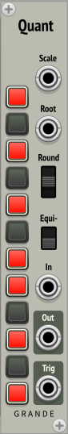
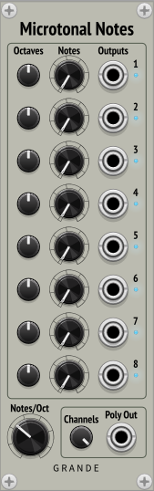

Grande Modules for VCV Rack 2
=============================

By David Grande

***

Clip
----

**Polyphonic hard clipper and visual clip monitor.**

Provides two separate polyphonic clippers with displays, which clip to ±5V by default. The clipping voltage is adjustable by knob (up to ±10V), or polyphonic input voltages (up to ±20V).

The display shows active channels in blue, while any currently clipping channels are shown in red. To use this just as a clip monitor, just attach the inputs and don’t pass through this module.

- **A In and Out:** First signal to be clipped/monitored (polyphonic).

- **B In and Out:** Second signal to be clipped/monitored (polyphonic).

- **Vclip knob:** Allows adjusting the clipping voltage from 0 to ±10V (default ±5V). Applies to both A and B inputs, and all channels. Note that this is only enabled if the Vclip input port is unconnected.

- **Vclip input:** Alternative for setting clipping voltages. Input voltages (polyphonic) directly define clipping voltage to use for A and B, which are clipped to ±Vclip (per channel). In this case input values can range from 0V to 20V, and negative input values are converted to positive values.

***

Merge8
------

**8-channel polyphonic merge.**

Provides an 8-channel mono-to-poly merger in a compact package.

*Based on my MergeSplit4 module, which was based on GPL3 code from 23Volts.*

***

MergeSplit4 (MS4)
-----------------

**4-channel polyphonic merge and split.**

Provides a 4-channel mono-to-poly merger and a 4-channel poly-to-mono splitter in a compact package.

Useful for feeding multiple monophonic signals into my polyphonic quantizers. Run Merge out to Quantizer In, and Quantizer Out back to Split In.

Note however that this combination, with a quantizer and **MergeSplit4,** adds three sample delays to the V/Oct path. My sampledelay modules can be used to match delays on the gate/trigger path (see below).

*Based on GPL3 code from 23Volts Merge4 and Split4, by Rémi Collins, at <https://github.com/23volts/23volts-vcv>. However, I didn’t use any of his artwork.*

***

PolyMergeResplit (PMR)
----------------

**Poly-to-poly Merge and Resplit back to the same channel widths.**

Provides a 4-to-1 poly-to-poly merger and a 1-to-4 poly-to-poly resplitter in a compact package.

Useful for combining multiple polyphonic signals, processing them with a single polyphonic module (such as a quantizer or VCO), and then resplitting the output signals back to their original number and channel widths.

**Merge:** Four polyphonic inputs to one polyphonic output.

- Channels are added to the output from the top input down.

- If the total number of input channels exceeds 16, the output is clamped to 16 channels, and a red warning light turns on.

- Note that unlike my **MergeSplit4,** skipped Merge inputs don’t add any channels to the output, but the corresponding Resplit outputs will also need to be skipped.

**Resplit:** One polyphonic input to four polyphonic outputs.

- The output channels mirror the Merge input channels, including gaps.

- A blue light next to each output indicates that this output has the same number of channels as the corresponding Merge input.

- A red light means that the channel count doesn’t match. Up means the output has too many channels, and down means too few channels.

**How to use PolyMergeResplit**

To route multiple polyphonic signals through one polyphonic quantizer:

- Connect any combination of poly and mono signals to the **PolyMergeResplit** Merge inputs. (If the total number of channels exceeds 16, a red warning light will come on.)

- Connect the **PMR** Merge output to the quantizer input.

- Connect the quantizer output back to the **PMR** Resplit input.

- Connect the corresponding quantized **PMR** Resplit outputs to wherever they need to go. They will automatically get set to the same channel widths as their inputs. (Blue lights indicate the channel counts match.)

***

PolySplit
---------

**Poly-to-poly splitter with visual selection of channel split points.**

Provides a 1-to-4 poly-to-poly splitter in a compact package.

The channels of the polyphonic input can be routed to up to four polyphonic outputs, with the split points defined by the triangular **split-point buttons** (bright red when selected).

- With no split points selected, all the input channels go to the first output.

- With one split point selected, the lower channels go to the first output and the upper channels go to the second output—if there are enough channels. (The blue **channel lights** on the right indicate the number of input channels.)

- This continues for the second and third split points, with higher channels going to the third and fourth outputs.

- If a fourth split point is selected, since there isn't a fifth output, this serves to truncate the number of channels in the fourth output. (The corresponding **channel lights** are dimmed to indicate when this happens.)

- If additional **split-point buttons** are selected, they are also dimmed to show that they are being ignored.

***

Quant
-----

**Normal 12-TET Quantizer with Equi-likely mode.**

- Combine with **MergeSplit4** or **PolyMergeResplit** to easily quantize multiple mono or poly signals respectively.

- **Scale:** Use **Scale** modules (see below) and a polyphonic switch to allow selecting different scales.

- **Root:** Defines root note of scale (1V/Oct, polyphonic), quantized.

- **Rounding mode:** Down = round down, center = round nearest, up = round up.

- **Equi-likely mode:** Down = off, up = on.

- **In:** Pitch input (1V/Oct, polyphonic).

- **Out:** Quantized pitch output (1V/Oct, polyphonic).

- **Trigger:** Outputs trigger whenever note changes (polyphonic).

- **Note buttons:** Set current scale, or display externally defined scale. Root on bottom. Defaults to major scale. If no notes are selected, defaults to just the root note.

**Factory Preset Scales *(new for version 2)***

Now easily set one of fourteen different common scales.

- Chromatic
- Major, Dorian, Phrygian, Lydian, Mixolydian, Aeolian *(Natural Minor)*, Locrian
- Harmonic Minor, Melodic Minor\*
- Major Pentatonic, Minor Pentatonic
- Blues, Whole Tone

\* *Just the modern ascending-only form of the Melodic Minor scale.*

**Explanation of Equi-likely mode**

Equi-likely mode changes the evenness of notes across the scale. The following images show the differences between normal mode and equi-likely mode using the Blues Scale, which is particularly obvious with its note intervals of 321132.

**Normal quantization** (and rounding down)

The probability of randomly getting each note (x-axis) depends on the interval between notes. Closely spaced notes are much less likely than farther spaced notes. With a random input, the probability of picking individual notes varies from 8% to 25%.

**Equi-likely quantization** (and rounding down)

In this case, every note is equally likely, with the probability of picking each note the same at 16.7.%

However, equi-likely mode is best for random input voltages. It can cause unexpected note shifting for inputs that are already more-or-less quantized.

***

SampleDelays (SD)
-----------------

**3 sample delay buffer chains.**

Provides three independent sample-delay buffer chains giving one or two sample delays each (polyphonic).

- Internally chained together to give up to six sample delays.

***

Scale
-----

**Extra scales for the Quant quantizer.**

- Sends 12 control signals using a polyphonic cable (0V or 10V).

- Route multiple **Scale** modules through a polyphonic switch, and into the Scale input of **Quant.**

- Provides the same fourteen factory preset scales as **Quant.**

***

Split8
------

**8-channel polyphonic split.**

Provides an 8-channel poly-to-mono splitter in a compact package.

*Based on my MergeSplit4 module, which was based on GPL3 code from 23Volts.*

***

Tails
-----

**Mono to poly sequential note splitter—helps preserve envelope tails.**

**Tails** takes a monophonic sequence of notes, as defined by a gate pulse and a V/Oct pitch value, and splits them into multiple polyphonic channels.

Gate pulse lengths are not changed, so there can still only be one active note playing at a time. However, by giving each note a separate channel, this allows for each note’s release envelope to continue playing in parallel, giving a much fuller sound.

This is particularly useful for irregular tempos, where widely spaced notes have time to play their tails, but closely spaced notes get cut off abruptly. Note however, that since there’s only one pitch value per note, chords are not directly supported.

**Without Tails:** Notes and their envelopes get cut off abruptly when a new note appears.

**With Tails:** Even with just two channels, notes and their envelopes now have significant overlap with the following note. Up to five channels are available for extreme cases.

**Warning:** Requires use of a polyphonic oscillator (fairly common), and a polyphonic envelope generator (not so common).

**Notes Section:**

- **Mono pitch input:** Feed in a monophonic sequence of V/Oct note pitches. Each value is latched on the rising edge of its corresponding gate pulse.

- **Poly pitch output:** Connect to the V/Oct input of a polyphonic oscillator.

- **Mono gate/trigger input:** Feed in a monophonic sequence of gate/trigger pulses, the more irregular the better.

- **Poly gate/trigger output:** Connect to the Gate or Trigger input of a polyphonic oscillator or envelope generator.

- **Chans knob:** Defines how many polyphonic channels to output, from 1 to 5.

**VCA Section:**

Also provides a polyphonic VCA, since some mixers don’t support true polyphonic Volume inputs.

- **VCA In and Out:** Polyphonic voltage-controlled attenuator (up to 16 channels).

- **VCA CV:** Control voltage for VCA attenuation (0-10V, up to 16 channels).

- **VCA Gain knob:** Sets overall gain for VCA (0-1×).

**Example patch:**

- **Marbles (random sampler):** To best demonstrate the effects of using **Tails,** set the **JITTER** knob all the way to the right (value = 1). Also, turning the **STEPS** knob clockwise gives more musical sequences.

- **Plaits (macro oscillator 2):** Lowering the **FREQUENCY** knob by two octaves gives more pleasant notes.

- **ADSR:** Set fairly short attack and decay times,such as 15ms, while making the release time fairly long, such as 300ms or more.

- **Tails:** While this patch is playing, alternate the number of channels between 1 and 5, and listen to the difference.

***

VarSampleDelays (VSD)
-----------------

**Quad independent variable sample-delay buffers.**

Provides four independent sample-delay buffers that can be adjusted between one and nine sample delays each (default 5, polyphonic).

- Each buffer is not internally connected to any others. If more than nine sample delays are needed, they can be connected externally.

***

The Microtonal Collection
=========================

***

MicrotonalChords
----------------

**A 1-TET through 34-TET microtonal quad chord generator.**

Provides four four-note microtonal chords, all based on current Notes/Oct setting. Chords are labeled A, B, C, and D. All four notes of the selected chord are output on Poly_Out, defined by the Select input.

- **Octaves** and **Notes** knobs: Set octave and note for each note of the chord based on current temperament. Notes knobs clamped to Notes/Oct – 1.

- **Notes/Oct:** Defines temperament, from 1 to 34 (default 12).

- **Select:** Defines which chord to output. 0V = A, 1V = B, 2V = C, 3V = D. A blue light indicates which chord is being output. With nothing connected, chord A is always output.

***

MicrotonalNotes
---------------

**A 1-TET through 34-TET microtonal octal note generator.**

Provides eight settable microtonal notes, all based on current Notes/Oct setting. Each provides a monophonic output, and they can all be combined in the polyphonic output at the bottom.

- **Octaves** and **Notes** knobs: Set octave and note based on current temperament. Notes knobs clamped to Notes/Oct – 1.

- **Notes/Oct:** Defines temperament, from 1 to 34 (default 12).

- **Channels:** Defines how many polyphonic channels to output (default 8, not randomized). Each enabled channel is indicated by a small blue light next to its monophonic output.

Combine with a polyphonic switch, like **SwitchN1** from 23volts, to make a simple microtonal sequencer.

***

NoteMT
------

**A 1-TET through 34-TET microtonal note generator and display preprocessor.**

- **Octave** and **Note** knobs: Set octave and note based on current temperament. Note knob clamped to Notes/Oct – 1.

- **V/Oct:** Output voltage defined by Octave and Note knobs (monophonic).

- **V/Oct-In:** Input voltage to preprocess for display. If unconnected, normalized to V/Oct output (polyphonic).

- **Round Notes:** Defines whether Note outputs rounded to integers. When using voltmeters with high precision, note voltages can be displayed as 2.999-something instead of 3. Therefore, I have added in the ability to round notes to integers. **Caution:** Only use this mode when you’re sure the Notes/Oct setting is correct. This mode is always disabled on power-up, and it’s disabled whenever the Notes/Oct setting is changed.

- **Octave** and **Note** outputs: Convert V/Oct-In voltage(s) (or knobs if input unconnected) into a pair of voltages, which can be displayed using a pair of voltmeters (polyphonic).

- **Notes/Oct:** Defines temperament, from 1 to 34 (default 12).

***

QuantIntervals
--------------

**A 1-TET through 34-TET microtonal quantizer.**

For this quantizer the valid notes are defined indirectly by pitch intervals.

- Combine with **MergeSplit4** or **PolyMergeResplit** to easily quantize multiple mono or poly signals respectively.

- The interval buttons select desired pitch intervals, which include all 13-limit intervals where the ratio and its octave complement are less than or equal to 36 (minus one pair).

- However, these intervals need to be mapped to notes in the selected temperament. Valid notes are those that match selected intervals within the specified tolerance. These are indicated by a blue light, with the brightness indicating how close the match is. In addition, the valid notes are also displayed on the numbered lights to the right.

- Only the closest intervals are generally highlighted. With so many intervals, it’s common for more than one to be within tolerance of a valid note.

- **Quantizer features:** The same as **Quant** (see above), minus the external scale input.

**Controls**

- **Notes/Oct:** Defines temperament, from 1 to 34 (default 12).

- **Tolerance:** Defines required accuracy for matching, from 0 to 50 cents (default 20 cents).

- **Show All:** Uses the lights to show **all** closest intervals within tolerance of a valid note.

- **Clear All:** Disables all intervals, except 1/1 unison.

- **Show Small:** Uses the lights to show all closest **small-number** intervals within tolerance of a valid note.

- **Clear Invalid:** Disables all intervals that don’t have a light showing.

- **Interval lights:** Displays if selected interval is valid, with brightness of the light showing how closely the interval matches the note. Lights are split in two, to show the direction to the closest valid note. If the top light is brighter, the valid note’s pitch is sharper than this interval, and if the bottom light is brighter, the valid note’s pitch is flatter than this interval. If both halves are full brightness, the interval matches the valid note within ±2.5¢.

- **Note lights:** Displays enabled notes using separate note lights.

- **LED Buttons:** All lights have been converted to LED buttons, both the interval lights and the note lights. Pressing any one of these highlights *(if they exist)* the corresponding note on the note display, and **all** the corresponding intervals on the interval display.

***

QuantMT
-------

**A 1-TET through 34-TET microtonal quantizer.**

For this quantizer the valid notes are defined directly by number.

- Combine with **MergeSplit4** or **PolyMergeResplit** to easily quantize multiple mono or poly signals respectively.

- **Quantizer features:** The same as **Quant** (see above), minus the external scale input.

- **Notes/Oct:** Defines temperament, from 1 to 34 (default 12).

- **Note buttons:** Buttons between the two blue lights on left enable valid notes. Notes outside this range are ignored.

- **Reference lights:** Optional **blue** lights on right that can be set and enabled with the Ref button. Just to give a visual reference scale to help with setting and changing scales. Lights maintain state through power cycles.

- **Set:** Enables all valid notes up to Notes/Oct – 1.

- **Clear:** Disables all notes, except for root note.

- **Mode:** Cycles through scale modes. As an example, starting with the major scale (Ionian mode), pressing this button will cycle through Dorian, Phrygian, Lydian, etc., until after seven presses it gets back to Ionian. (However, it doesn’t make much sense if the root note is disabled—so in this case it just rotates notes down one note.)

- **Ref:** Short press toggles display of reference lights. Long press (≥ 2 sec) sets and turns on reference lights based on current note buttons.

***

License
-------

- Source Code: [GPL-3.0+](http://www.gnu.org/licenses/gpl.html)

- Artwork: [CC BY-NC-ND 4.0](https://creativecommons.org/licenses/by-nc-nd/4.0/)
