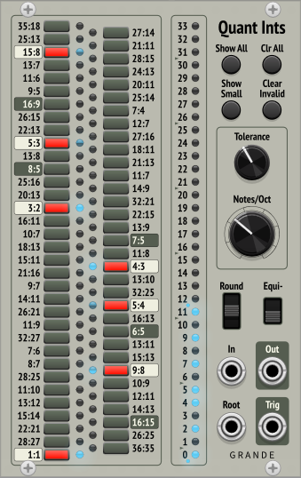

Grande Modules for VCV Rack 1.0
===============================

By David Grande

***

Quant
-----

**Normal 12-TET Quantizer with Equi-likely mode.**

- **Scale:** Use **Scale** modules (see directly below) and polyphonic switch to allow selecting different scales.

- **Root:** Defines root note of scale (1V/Oct, polyphonic), quantized.

- **Rounding mode:** Down = round down, center = round nearest, up = round up.

- **Equi-likely mode:** Down = off, up = on.

- **In:** CV input (1V/Oct, polyphonic).

- **Out:** Quantized CV output (1V/Oct, polyphonic).

- **Trigger:** Trigger whenever note changes (polyphonic).

- **Note buttons:** Set current scale, or display externally defined scale. Root on bottom. Defaults to major scale. If no notes are selected, defaults to just the root note.

**Explanation of Equi-likely mode**

Equi-likely mode changes the evenness of notes across the scale. The following images show the differences between normal mode and equi-likely mode using the Blues Scale, which is particularly obvious with its note intervals of 321132. 

**Normal quantization** (and rounding down)

The probability of randomly getting each note (x-axis) depends on the interval between notes. Closely spaced notes are much less likely than farther spaced notes. With a random input, the probability of picking individual notes varies from 8% to 25%.

**Equi-likely quantization** (and rounding down)

In this case, every note is equally likely, with the probability of picking each note the same at 16.7.%

However, equi-likely mode is best for random input voltages. It can cause unexpected note shifting for inputs that are already more-or-less quantized.

***

Scale
-----

**Extra scales for the Quant quantizer.**

- Sends 12 control signals using a polyphonic cable (0V or 10V).

- Use a polyphonic switch, like the one from Bogaudio, and plug it into the Scale input of **Quant.**

***

QuantMT
-------
***Updated for v1.1.0***

**A 1-TET through 34-TET microtonal quantizer.**

For this quantizer the valid notes are defined directly by number.

- **Quantizer features:** The same as **Quant** (see above), minus the external scale input. 

- **Notes/Oct:** Defines temperament, from 1 to 34 (default 12).

- **Note buttons:** Buttons between the two blue lights (now on left for v1.1.0) enable valid notes. Notes outside this range are ignored.

- **Reference lights (New for v1.1.0):** Optional lights (on right of notes) that can be set and enabled with the Ref button. Just to give a visual reference scale to help with setting and changing scales. Lights maintain state through power cycles.

- **Set:** Enables all valid notes. (New for v1.1.0, only enables notes up to Notes/Oct – 1.)

- **Clear:** Disables all notes, except for root note.

- **Mode (New for v1.1.0):** Cycles through scale modes. As an example, starting with the major scale (Ionian mode), pressing this button will cycle through Dorian, Phrygian, Lydian, etc., until after seven presses it gets back to Ionian. (However, it doesn't make much sense if the root note is disabled—so in this case it just rotates notes down one note.)

- **Ref (New for v1.1.0):** Sets and enables reference lights based on current note buttons. Reference lights stay on until Ref button is turned off.

***

QuantIntervals
--------------

**A 1-TET through 34-TET microtonal quantizer.**

For this quantizer the valid notes are defined indirectly by pitch intervals.

- The interval buttons select desired pitch intervals, which now include all 11-Limit intervals up to 36.

- However, these intervals need to be mapped to notes in the selected temperament. Valid notes are those that match selected intervals within the specified tolerance. These are indicated by a blue light, with the brightness indicating how close the match is.

- Only the closest intervals are generally highlighted. With so many intervals, it's common for more than one to be within tolerance of a valid note.

- **Quantizer features:** The same as **Quant** (see above), minus the external scale input. 

**Note on sizes**

With so many different intervals, I needed to provide ways to select and filter out subsets of ratios.

- **small** = small ratios, with denominators ≤ 10, or 16:15 (C#), which is the only 12-TET chromatic note that wouldn't qualify as small.
- **medium** = ratios in the 10's and 20's range.
- **large** = ratios with 30+, or with denominators ≥ 25.

**Controls**

- **Notes/Oct:** Defines temperament, from 1 to 34 (default 12).

- **Tolerance:** Defines required accuracy for matching, from 0 to 50 cents (default 20 cents).

- **Set Small:** Enables just the **small** intervals.

- **Set All:** Enables **all** intervals.

- **Clear All:** Disables all intervals, except 1/1 unison.

- **Show Small:** Uses the lights to show all closest **small** intervals within tolerance of a valid note.

- **Show Valid:** Uses the lights to show **all** closest intervals within tolerance of a valid note.

- **Clear Invalid:** Disables all intervals that don't have a light showing.

- **Remove Large:** Disables all **large** intervals.

- **Remove Medium:** — Disables all **medium** (and **large**) intervals.

- **Add 11s/7s/5s/3s:** — Enables all intervals with the specified factor to that limit. For example, **Add 7s** will add 7:5 and 15:14, but not 11:7.

- **Just:** Gives an approximation to Just temperament (independent of Notes/Oct). Current worst case error is one cent.

- **Show Notes:** Displays actual notes being used on left column of blue lights (root note at bottom). Useful for understanding what this quantizer is doing, and allows converting its results to another quantizer, like **QuantMT.** However, this feature is disabled when using Just temperament.

***

NoteMT
------

**A 1-TET through 34-TET microtonal note generator and display preprocessor.**

- **Octave** and **Note** knobs: Set octave and note based on current temperament. Note knob clamped to Notes/Oct – 1.

- **V/Oct:** Output voltage defined by Octave and Note knobs.

- **V/Oct-In:** Input voltage to preprocess for display. If unconnected, normalized to V/Oct output.

- **Octave** and **Note** outputs: Convert V/Oct-In voltage (or knobs if input unconnected) into a pair of integer voltages. These can be displayed on a voltmeter, like the one from ML Modules.

- **Notes/Oct:** Defines temperament, from 1 to 34 (default 12).

- A blue light at the top turns on when the Note output values are integers, indicating that the Notes/Oct setting is likely matching the V/Oct-In source. However, this is not guaranteed.

***

SampleDelays (SD)
-----------------

**3 sample delay buffer chains.**

Provides three sample-delay buffer chains giving one or two sample delays each.

- Internally chained together to give up to six sample delays.

***

License
-------

GPL-3.0+
