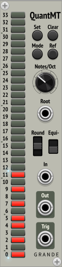

Grande Modules for VCV Rack 1.0
===============================

By David Grande

***

Tails
-------------------
***New for v1.7.0***

**Mono to poly sequential note splitter—helps preserve envelope tails.**

**Tails** takes a monophonic sequence of notes, as defined by a gate/trigger and a V/Oct voltage, and moves each note to the next available polyphonic output channels. Then using a polyphonic oscillator and a polyphonic envelope generator, these notes can be played simultaneously, giving a much fuller sound. The envelope tails don't have to be cut short at the next note, and can play through most (or all) of their length.

**Without Tails:** Notes and their envelopes get cut off abruptly when a new note appears.

**With Tails:** Even with just two channels, notes and their envelopes now have significant overlap with the following note. Up to five channels are available for extreme cases. 

**Warning:** Requires use of a polyphonic oscillator (common), and a polyphonic envelope generator (not so common).

- **Gate In (mono) and Out (poly):** On rising edge of Gate input, V/Oct input is sampled, and both Gate and sampled V/Oct are output on the next poly channel (up to five channels available). Output should be connected to Gate input of a polyphonic envelope generator.

- **V/Oct In (mono) and Out (poly):**  Note values are sampled on the rising edge of the Gate input, and output to the corresponding poly output channel. Output should be connected to V/Oct input of a polyphonic oscillator.

- **Channels knob:** Defines how many polyphonic channels to cycle through, from 1 (off) to 5.

Also provides a polyphonic VCA, since some mixers don't support true polyphonic Volume inputs.

- **VCA In and Out:** Polyphonic voltage-controlled attenuator (up to 16 channels).

- **VCA CV:** Control voltage for VCA attenuation (up to 16 channels).

- **VCA Gain knob:** Sets overall gain for VCA (0-1×).

**Example patch:**

***

Quant
-----

**Normal 12-TET Quantizer with Equi-likely mode.**

- Combine with **MergeSplit4** to easily quantize up to four monophonic signals. Connect its Merge output to Quantizer In, and connect Quantizer Out back to its Split input.

- **Scale:** Use **Scale** modules (see directly below) and polyphonic switch to allow selecting different scales.

- **Root:** Defines root note of scale (1V/Oct, polyphonic), quantized.

- **Rounding mode:** Down = round down, center = round nearest, up = round up.

- **Equi-likely mode:** Down = off, up = on.

- **In:** CV input (1V/Oct, polyphonic).

- **Out:** Quantized CV output (1V/Oct, polyphonic).

- **Trigger:** Trigger whenever note changes (polyphonic).

- **Note buttons:** Set current scale, or display externally defined scale. Root on bottom. Defaults to major scale. If no notes are selected, defaults to just the root note.

**Explanation of Equi-likely mode**

Equi-likely mode changes the evenness of notes across the scale. The following images show the differences between normal mode and equi-likely mode using the Blues Scale, which is particularly obvious with its note intervals of 321132. 

**Normal quantization** (and rounding down)

The probability of randomly getting each note (x-axis) depends on the interval between notes. Closely spaced notes are much less likely than farther spaced notes. With a random input, the probability of picking individual notes varies from 8% to 25%.

**Equi-likely quantization** (and rounding down)

In this case, every note is equally likely, with the probability of picking each note the same at 16.7.%

However, equi-likely mode is best for random input voltages. It can cause unexpected note shifting for inputs that are already more-or-less quantized.

***

Scale
-----

**Extra scales for the Quant quantizer.**

- Sends 12 control signals using a polyphonic cable (0V or 10V).

- Use a polyphonic switch, like the one from Bogaudio, and plug it into the Scale input of **Quant.**

***

QuantMT
-------

**A 1-TET through 34-TET microtonal quantizer.**

For this quantizer the valid notes are defined directly by number.

- Combine with **MergeSplit4** to easily quantize up to four monophonic signals. Connect its Merge output to Quantizer In, and connect Quantizer Out back to its Split input.

- **Quantizer features:** The same as **Quant** (see above), minus the external scale input. 

- **Notes/Oct:** Defines temperament, from 1 to 34 (default 12).

- **Note buttons:** Buttons between the two blue lights on left enable valid notes. Notes outside this range are ignored.

- **Reference lights:** Optional **now blue** lights on right that can be set and enabled with the Ref button. Just to give a visual reference scale to help with setting and changing scales. Lights maintain state through power cycles.

- **Set:** Enables all valid notes up to Notes/Oct – 1.

- **Clear:** Disables all notes, except for root note.

- **Mode:** Cycles through scale modes. As an example, starting with the major scale (Ionian mode), pressing this button will cycle through Dorian, Phrygian, Lydian, etc., until after seven presses it gets back to Ionian. (However, it doesn't make much sense if the root note is disabled—so in this case it just rotates notes down one note.)

- **Ref:** Short press toggles display of reference lights. Long press (now ≥ 2 sec) sets and turns on reference lights based on current note buttons.

***

QuantIntervals
--------------

**A 1-TET through 34-TET microtonal quantizer.**

For this quantizer the valid notes are defined indirectly by pitch intervals.

- Combine with **MergeSplit4** to easily quantize up to four monophonic signals. Connect its Merge output to Quantizer In, and connect Quantizer Out back to its Split input.

- The interval buttons select desired pitch intervals, which now include all 13-limit intervals where the ratio and its octave complement are less than or equal to 36.

- However, these intervals need to be mapped to notes in the selected temperament. Valid notes are those that match selected intervals within the specified tolerance. These are indicated by a blue light, with the brightness indicating how close the match is. In addition, the valid notes are also displayed on the numbered lights to the right.

- Only the closest intervals are generally highlighted. With so many intervals, it's common for more than one to be within tolerance of a valid note.

- **Quantizer features:** The same as **Quant** (see above), minus the external scale input. 

**Controls**

- **Notes/Oct:** Defines temperament, from 1 to 34 (default 12).

- **Tolerance:** Defines required accuracy for matching, from 0 to 50 cents (default 20 cents).

- **Show All:** Uses the lights to show **all** closest intervals within tolerance of a valid note. *(They will now have to be selected individually.)*

- **Clear All:** Disables all intervals, except 1/1 unison.

- **Show Small:** Uses the lights to show all closest **small-number** intervals within tolerance of a valid note. *(They will also have to be selected individually.)*

- **Clear Invalid:** Disables all intervals that don't have a light showing.

- **Interval lights:** Displays if selected interval is valid, with brightness of the light showing how closely the interval matches the note.

- **Note lights:** Now displays enabled notes using separate note lights.

- **LED Buttons:** All lights have been converted to LED buttons, both the interval lights and the note lights. Pressing any one of these highlights *(if they exist)* the corresponding note on the note display, and **all** the corresponding intervals on the interval display.

***

MicrotonalNotes
------

**A 1-TET through 34-TET microtonal octal note generator.**

Provides eight settable microtonal notes, all based on current Notes/Oct setting. Each provides a monophonic output, and they can all be combined in the polyphonic output at the bottom. 

- **Octaves** and **Notes** knobs: Set octave and note based on current temperament. Notes knobs clamped to Notes/Oct – 1.

- **Notes/Oct:** Defines temperament, from 1 to 34 (default 12).

- **Channels:** Defines how many polyphonic channels to output (default 8, not randomized). Each enabled channel is indicated by a small blue light next to its monophonic output.

Combine with a polyphonic switch, like **SwitchN1** from 23volts, to make a simple microtonal sequencer.

***

MicrotonalChords
------

**A 1-TET through 34-TET microtonal quad chord generator.**

Provides four four-note microtonal chords, all based on current Notes/Oct setting. Chords are labeled A, B, C, and D. All four notes of the selected chord are output on Poly_Out, defined by the Select input.

- **Octaves** and **Notes** knobs: Set octave and note for each note of the chord based on current temperament. Notes knobs clamped to Notes/Oct – 1.

- **Notes/Oct:** Defines temperament, from 1 to 34 (default 12).

- **Select:** Defines which chord to output. 0V = A, 1V = B, 2V = C, 3V = D. A blue light indicates which chord is being output. With nothing connected, chord A is always output.

***

NoteMT
------

**A 1-TET through 34-TET microtonal note generator and display preprocessor.**

- **Octave** and **Note** knobs: Set octave and note based on current temperament. Note knob clamped to Notes/Oct – 1.

- **V/Oct:** Output voltage defined by Octave and Note knobs (still monophonic).

- **V/Oct-In:** Input voltage to preprocess for display. If unconnected, normalized to V/Oct output (now polyphonic).

- **Round Notes:** Defines whether Note outputs rounded to integers. When using voltmeters with high precision, note voltages can be displayed as 2.999-something instead of 3. Therefore, I have added in the ability to round notes to integers. **Caution:** Only use this mode when you're sure the Notes/Oct setting is correct. This mode is always disabled on power-up, and it's disabled whenever the Notes/Oct setting is changed.

- **Octave** and **Note** outputs: Convert V/Oct-In voltage (or knobs if input unconnected) into a pair of integer voltages. These can be displayed on a voltmeter, like the one from ML Modules. (Now polyphonic, so can also use a pair of polyphonic voltmeters, like **Debug** from computerscare.)

- **Notes/Oct:** Defines temperament, from 1 to 34 (default 12).

***

SampleDelays (SD)
-----------------

**3 sample delay buffer chains.**

Provides three sample-delay buffer chains giving one or two sample delays each.

- Internally chained together to give up to six sample delays.

***

MergeSplit4 (MS4)
-----------------

**4-channel polyphonic merge and split.**

Provides a 4-channel polyphonic merger and a 4-channel polyphonic splitter in a compact package.

Useful for feeding multiple monophonic signals into my polyphonic quantizers. Run Merge out to Quantizer In, and Quantizer Out back to Split In.

Based on GPL3 code from 23Volts Merge4 and Split4, by Rémi Collins, at <https://github.com/23volts/23volts-vcv>. However, I didn't use any of his artwork.

***

License
-------

GPL-3.0+
